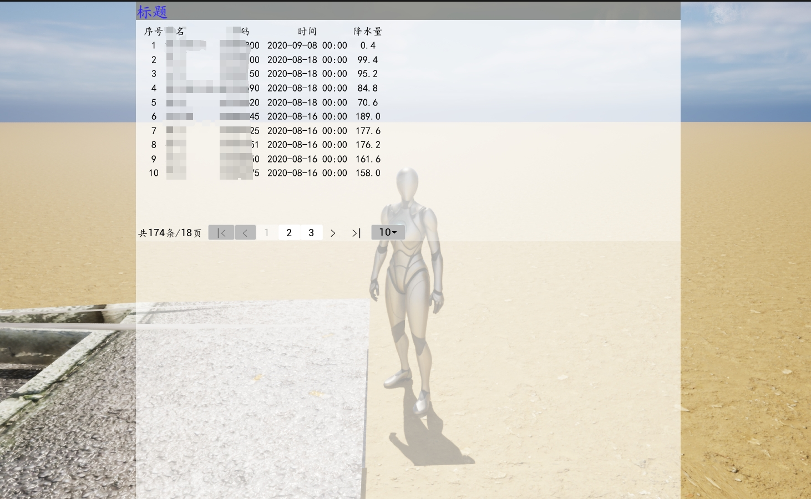

# UE_UMG_TableView_Web
This smart asset is designed for UE projects and is a UMG (Unreal Motion Graphics) smart asset. It displays JSON data in a table format and allows dynamic configuration of parameters, enabling the display of different tables based on the configuration.  

[中文](README_CN.md) | [English](README.md) 
## Features
- **Dynamic Table Display**: Dynamically populate the table content based on the data returned from the API.
- **Pagination Support**: Supports API pagination by configuring the `pageSize` and `pageNum` parameters.
- **Field Configuration**: Allows you to configure the name, data type, and width for each column.
- **HTTP POST Request**: Table data is fetched via POST requests from a specified URL, enabling integration with backend APIs.
- **UMG Configuration**: All configuration options are exposed and adjustable via the UMG editor, making it easy to integrate and modify.

## Prerequisites
- Unreal Engine version: 5.4
- Plugin: Enable `vaRest`
- web server support json: `Java Spring Boot` or `Python http.server`

## Installation
1. Clone this repository or download the `UMG_TableView_Web` package.  
   `git clone <url>`
2. Import the resources into your UE project.
3. Create or modify a UMG Widget and add the `UMG_TableView_Web` component to display the table. You can also refer to the Level provided in the project named 'tableView.umap'.
4. Adjust the parameters as needed.

## Usage

### 1. Load the Table in the Level
Create the component in the level and add it to the viewport. You can refer to the demo level for an example.

### 2. Configure the POST Request
In the component's properties panel, configure the following parameters:
- **POST URL**: Set the API URL for the data source.
- **PageSize**: Set the number of items to display per page.
- **PageNum**: Set the current page number.

### 3. Configure the Fields
For each field, configure the name, data type, and column width. These settings can be managed easily via the UMG editor using nodes or Blueprint scripting.

### 4. Run the Level
Once the component is loaded, it will automatically send a POST request to fetch the data. The table will be dynamically updated based on the returned JSON data.

## Parameter Configuration Explained

### Layout
- **Layout Width**: Set the width of the table.
- **Layout Height**: Set the height of the table.

### Pagination
- **Page Num**: Default page number.
- **Page Size**: Default number of records per page.
- **Total Pages**: Total number of pages. Do not modify; default is 0.
- **Show Neighbor Page Size**: Display the number of neighboring page numbers next to the current page.
- **Query URL**: The URL to fetch data from.
- **Send Type**: HTTP request method (`POST` or `GET`).
- **Response Page Total**: The key in the JSON response that represents the total number of pages.
- **Response Total**: The key in the JSON response that represents the total number of records.
- **Response List**: The key in the JSON response that contains the list of records to display.
- **Total Record**: Variable for displaying the total number of records.
- **Page List Data**: Do not modify.
- **Page List Data Obj**: Do not modify.

### Table
- **Field Struct**: A struct that represents the structure of the returned JSON data. Create the struct in UE and reference it here.
- **Show Field Set**: Controls which fields are displayed, such as "Index", "Name", "Gender", etc. These are set according to the struct and are automatically parsed and displayed in UE.
- **Loading Finished**: Indicates whether loading is complete (currently not in use).

### Table Field Configuration - Show Field Set
- **fieldName**: The key in the JSON data for the field to be displayed.
- **showField**: The name to be displayed (e.g., "Name", "Gender").
- **Vtype**: The field's data type (`Integer`, `String`, `Date`, etc.).
- **textAlignment**: The alignment of the text in the column.
- **width**: The width of the column.
- **order**: The order in which the columns are rendered (no need to configure; the order in the list determines the render order).
- **autoHidden**: Not currently functional.
- **dotNumber**: The number of decimal places to retain for numeric fields. For example, `2` means two decimal places.
- **font**: Font settings, including font type, size, and color.

### Foreign Key Configuration
- **Foreign Query URL**: The URL to fetch foreign key data.
- **Foreign Query List Key**: The key in the foreign key JSON data representing the list of items.
- **Foreign Query Type**: The HTTP request method (`POST` or `GET`).
- **Loading Foreign Finished**: Indicates whether the foreign data loading is complete (currently not in use).
- **Foreign List**: The list of foreign key data storage (no need to configure).

### Foreign Key Example
For example, two entities: `Person` (P) and `Gender` (G), with the following data:
- `P = {name: 'name1', gender: 0, age: 20, height: 175}`
- `G = [{code: 0, nm: 'Female'}, {code: 1, nm: 'Male'}]`

In UE, create two structs corresponding to these objects. Then, in `table > Show Field Set`, add an item for the `gender` field. When displaying the gender, configure it as `gender.nm`, using the dot notation to reference the foreign key.  

