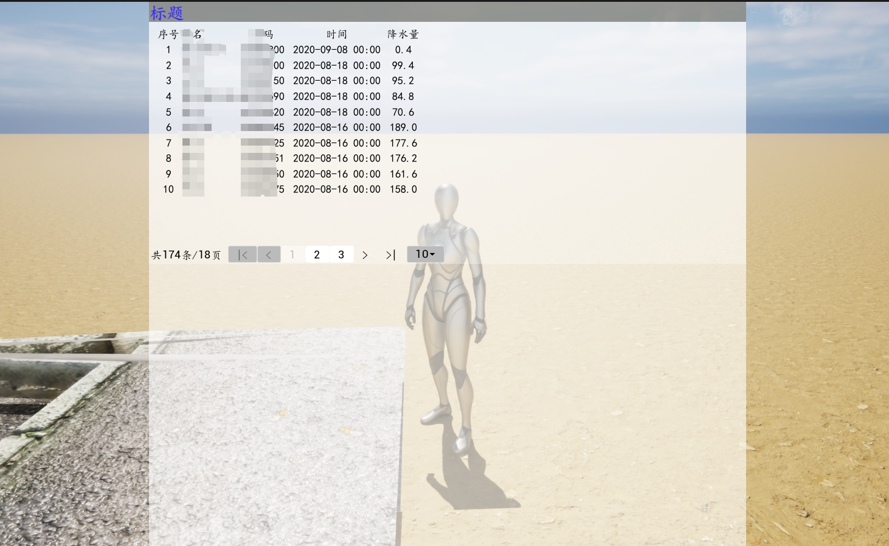
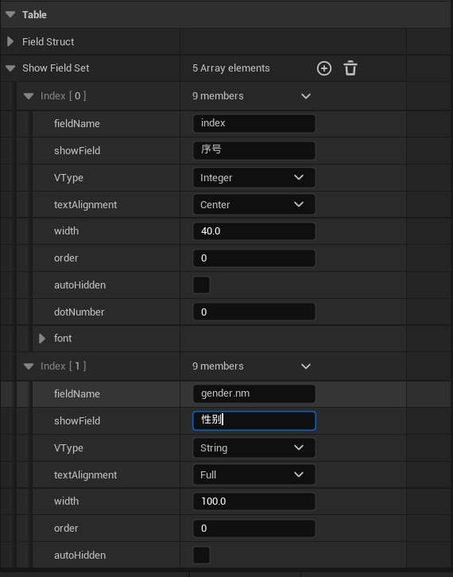

# UE_UMG_TableView_Web
[中文](README_CN.md) | [English](README.md)  
UE5智能素材，旨在通过UMG暴露的配置参数动态显示表格。通过提供 POST 请求 URL、当前页码、每页n条记录、以及表格字段的详细配置，可以灵活地展示来自Web API的数据。该素材支持多列配置，允许自定义列的名称、类型和宽度，方便在UE项目中显示动态数据。  

## 特点
- 动态表格显示：根据API返回的数据动态填充表格内容。
- 分页支持：通过配置 pageSize 和 pageNum 参数，支持API分页。
- 字段配置：可以设置每个字段的名称、数据类型以及列宽。
- HTTP POST请求：表格数据通过POST请求从指定的URL获取，支持与后端API的集成。
- UMG配置化：所有配置项都通过UMG编辑器进行暴露和调整，便于快速集成和修改。
## 安装前置条件
- UE 版本 5.4
- 插件Plugin: 启用vaRest
## 安装
1. 克隆本项目或下载UMG_TableView_Web资源包。`git clone <url>` .
2. 将资源导入到您的UE项目中。
3. 在UMG中创建或修改界面，使用UMG_TableView_Web进行表格展示。或查看本项目实例。
4. 修改参数即可。 
## 用法
1. 关卡中加载表格
   关卡中创建组件，并添加到视图中。可查看关卡案例 demo

2. 配置POST请求
   在组件的属性面板中，配置以下参数：
   `POST URL`：设置数据源API的URL。
   `PageSize`：设置每页展示的数据条数。
   `PageNum`：设置当前的页码。
3. 配置字段
   为每个字段配置名称、数据类型和列宽度。这些设置可以在UMG编辑器中通过节点或蓝图脚本轻松管理。

4. 运行关卡
   当组件加载时，它会自动发起POST请求并获取返回数据。表格将根据返回的JSON数据动态更新。
## 参数配置详解
### 布局 Layout
- Layout width: 宽度 
- Layout height: 高度
### 分页 Page
- Page Num: 默认页码
- Page Size: 默认每页n条记录
- Total page: 总页数，无需修改，默认0
- Show Neighber Page Size: 当前页旁边显示n个页码
- Query Url: 请求数据的url
- Send Type: url请求方式，post、get
- Response page Total: 响应数据json中，总页数的key
- Response Total: 响应数据json中，总记录数的key
- Response List: 响应数据json中，要显示的记录，对应的list的json的key
- Total record: 变量，用于显示总记录数
- Page List Data: 无需修改
- Page List Data Obj: 无需修改

### 表格 Table
- Field Struct: 结构体，json返回数据的结构体。通过UE创建结构体，在此处引用
- Show Field Set:用于控制显示的字段，比如序号、名称、性别等，此处按照结构体进行设置，自动解析并显示到UE  
- Loading Finished: 是否加载完成，暂不可用
### 表格字段配置 Show Field Set
- fieldName: 要显示的字段的json的key
- showField: 显示时的名，中文
- Vtype: 字段类型，有Integer、String、Date等
- textAlignment: 对齐方式
- width: 该列宽度
- order: 无需配置，编写的顺序，就是渲染的顺序
- autoHidden: 暂无效果
- dotNumber: 小数点保留精度，整数类型。比如2表示保留小数点后两位
- font: 字体，可以设置字体及大小颜色等。
### 外键 Foreign 
- Foreign Query Url: 外键数据的请求url
- Foreign Query List Key: list对象对应的json数据key
- Foreign Query Type: 发送url的时候，请求方式 post、get
- Loading Foreign Finished: 是否加载完成，暂不可用
- Foreign List: 外键数据存储表，无需设置
### 外键设置示例 Foreign example
比如两个类，: `人员` (P) and `性别` (G), 示例数据如下:
- `P = {name: 'name1', gender: 0, age: 20, height: 175}`
- `G = [{code: 0, nm: '女'}, {code: 1, nm: '男'}]` 
UE中新建2个结构体，字段与案例要对应，然后在`table > show Field Set`中新建项item。 
显示性别时，配置为`gender.nm`，通过点.表示需要调用外键。

